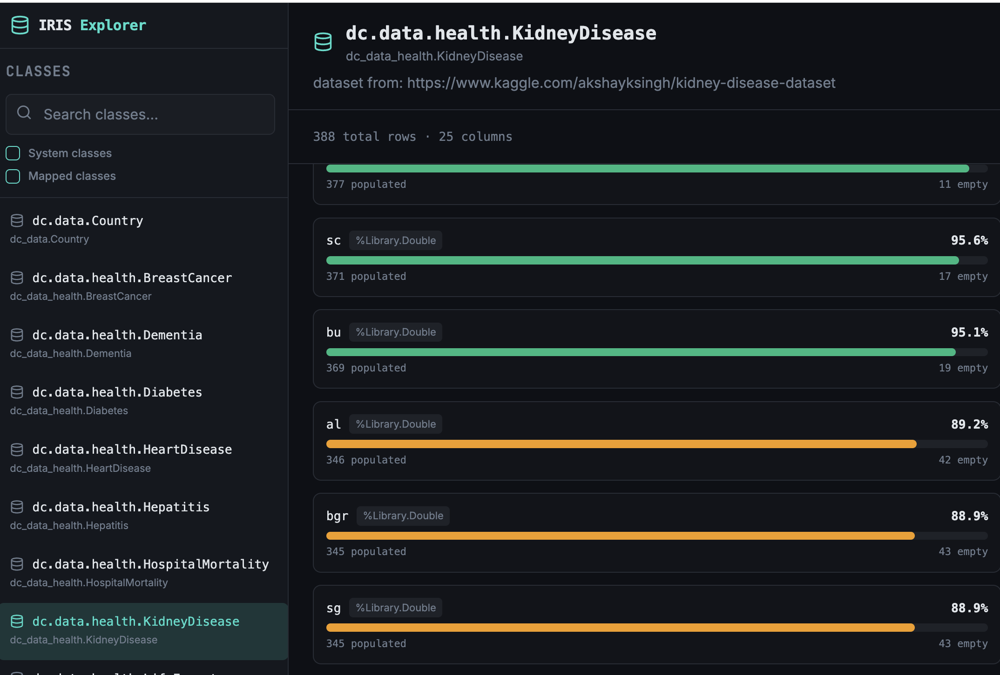

# IRIS Table Stats

`iris-table-stats` is an InterSystems IRIS backend module for exploring persistent classes and measuring how well their fields are populated.

It is intended for data quality and data knowledge use cases:
- list persistent classes available in the current namespace
- browse records of a selected class
- calculate per-column population stats
- find records where a selected column is empty

The module exposes a REST API under `/iris-table-stats/api`.

## What This Repo Provides

After installation, the backend exposes endpoints such as:
- `GET /iris-table-stats/api/classes`
- `GET /iris-table-stats/api/classes/{className}/data`
- `GET /iris-table-stats/api/classes/{className}/stats`
- `GET /iris-table-stats/api/classes/{className}/empty-records?columnName=...`
- `GET /iris-table-stats/api/_spec`

The `/stats` endpoint is especially useful to understand how complete a table is. For each property of a persistent class, it reports:
- populated count
- empty count
- populated percent
- empty percent

## Typical Use Case

This project is useful when you want to answer questions like:
- which tables in this namespace are worth exploring
- which columns are mostly empty
- which columns are consistently populated
- which records are missing values in a specific field

That makes it a good fit for demo environments, imported datasets, discovery projects, and data-quality reviews.

## Install On A Target IRIS With IPM

If your target IRIS does not yet have IPM/ZPM installed, install it first.

Then open an IRIS terminal in the target namespace and install the backend package.

Example:

```objectscript
USER>zpm
USER:zpm>install esh-iris-table-stats
```

If you are using the test registry, you can switch to it first:

```objectscript
USER>zpm
USER:zpm>repo -n registry -r -url https://test.pm.community.intersystems.com/registry/ -user test -pass PassWord42
USER:zpm>install esh-iris-table-stats
```

To switch back to the public registry:

```objectscript
USER:zpm>repo -r -n registry -url https://pm.community.intersystems.com/ -user "" -pass ""
```

If you want to install directly from source during development:

```objectscript
USER>zpm
USER:zpm>load /path/to/iris-table-stats
USER:zpm>install esh-iris-table-stats
```

## Related Dataset Packages

This backend becomes much more useful when it is installed together with demo or sample datasets.

Recommended companion packages:
- `iris-dataset-countries`
  - Open Exchange: `https://openexchange.intersystems.com/package/iris-dataset-countries`
- `Health-Dataset`
  - Open Exchange: `https://openexchange.intersystems.com/package/Health-Dataset`
  - Author: Jury

These packages give you realistic persistent classes to inspect through this API and make the population stats endpoints much more meaningful.

## Recommended Frontend

Recommended UI:
- `iris-class-explorer`
  - GitHub: `https://github.com/evshvarov/iris-class-explorer`

The frontend is intended to work together with this backend and provides a class explorer UI on top of the API.

Install the frontend package with IPM as well:

```objectscript
USER>zpm
USER:zpm>install iris-table-stats-frontend
```

Example UI screenshots:

Data view:


Stats view:



A typical setup on a target IRIS looks like this:

```objectscript
USER>zpm
USER:zpm>install esh-iris-table-stats
USER:zpm>install iris-table-stats-frontend
```

If you also want sample data:

```objectscript
USER>zpm
USER:zpm>install esh-iris-table-stats
USER:zpm>install iris-table-stats-frontend
USER:zpm>install iris-dataset-countries
```

or:

```objectscript
USER>zpm
USER:zpm>install esh-iris-table-stats
USER:zpm>install iris-table-stats-frontend
USER:zpm>install Health-Dataset
```

## API Notes

The backend web application is installed at:

`/iris-table-stats/api`

The OpenAPI spec is available at:

`/iris-table-stats/api/_spec`

Examples:

```text
/iris-table-stats/api/classes
/iris-table-stats/api/classes?includeSystem=0&includeMapped=0
/iris-table-stats/api/classes/Package.Class/data?limit=100&offset=0
/iris-table-stats/api/classes/Package.Class/stats
/iris-table-stats/api/classes/Package.Class/empty-records?columnName=SomeProperty
```

## Local Development

Prerequisites:
- Docker Desktop
- Git
- VS Code with the ObjectScript extension if you want an editor workflow

Build and run locally:

```bash
docker compose build
docker compose up -d
```

Open an IRIS terminal:

```bash
docker compose exec iris iris session iris -U USER
```

Run the module tests:

```objectscript
USER>zpm
USER:zpm>test esh-iris-table-stats
```

## Summary

Use this repository when you need a small IRIS backend that helps you understand how well persistent class data is populated, especially when paired with sample datasets and the `iris-table-stats-frontend` UI.
